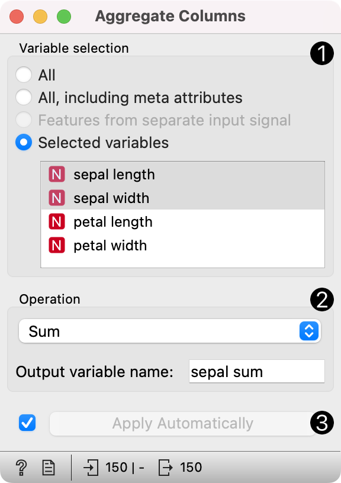

Aggregate Columns
=================

Compute a sum, max, min ... of selected columns.

**Inputs**

- Data: input dataset
- Features: list of attributes

**Outputs**

- Data: extended dataset

**Aggregate Columns** outputs an aggregation of selected columns, for example a sum, min, max, etc.

{width=70%}

1. Selected attributes.
2. Operators for aggregation:
   - sum
   - product
   - min
   - max
   - mean
   - variance
   - median

   *Output variable name*: Set the name of the computed attribute.
3. If *Apply automatically* is ticked, changes will be communicated automatically. Alternatively, click *Apply*.

Examples
--------

We will use iris data from the [File](../data/file.md) widget for this example and connect it to **Aggregate Columns**.

Say we wish to compute a sum of *sepal_length* and *sepal_width* attributes. We select the two attributes from the list and apply the sum aggregator.

We can observe the output in a [Data Table](../data/datatable.md).

It is possible to pass the list of features to Aggregate Columns via its *Features* input. Say we find a pair of informative features in a [Scatter Plot](../visualize/scatterplot.md) and we would like to compute their sum.

Beside the *Data* input, we also pass the *Features* input from the Scatter Plot to Aggregate Columns. The widget will, by default, use the input signal for variable selection. We retain the sum operation and change the name of the output variable to *petal sum*.

