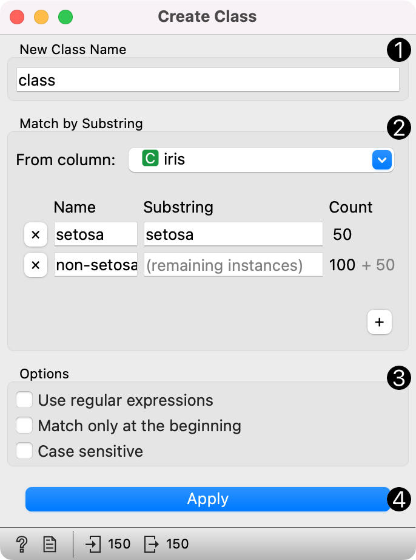
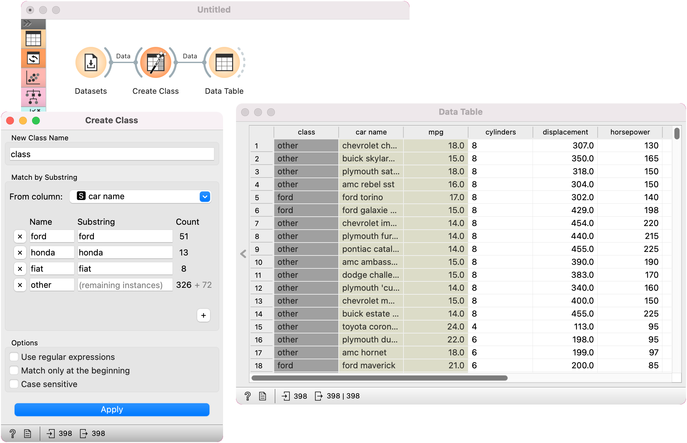

Create Class
============

Create class attribute from a string or categorical attribute.

**Inputs**

- Data: input dataset

**Outputs**

- Data: dataset with a new class variable

**Create Class** creates a new class attribute from an existing categorical or text attribute. The widget matches the string value of the selected attribute and constructs a new user-defined value for matching instances.

{width=50%}

1. Name of the new class column.
2. Match by Substring:
   *From column*: The attribute the new class is constructed from.
   *Name*: the name of the new class value
   *Substring*: substring that will match the values from the above-defined attribute
   *Count*: the number of instances matching the substring
   Press '+' to add a new class value
3. Options:
   - *Use regular expressions* to match by [regular expressions](https://en.wikipedia.org/wiki/Regular_expression).
   - *Match only at the beginning* will begin matching from the beginning of the string.
   - *Case sensitive* will match by case, too.
4. Press *Apply* to commit the results.

Example
-------

Here is a simple example with the *auto-mpg* dataset. Pass the data to **Create Class**. Select *car name* as a column to create the new class from. Here, we wish to create new values that match the car brand.

First, we type *ford* as the new value for the matching strings. Then we define the substring that will match the data instances. This means that all instances containing *ford* in their *car name*, will now have a value *ford* in the new class column. We define the same for *honda* and *fiat*. The widget will tell us how many instance are yet unmatched (remaining instances). It says 326, plus the already defined 72. We will name the remaining instances *other*, but you can continue creating new values by adding a condition with '+'.

Finally, we can observe the new column in a [Data Table](../data/datatable.md).
