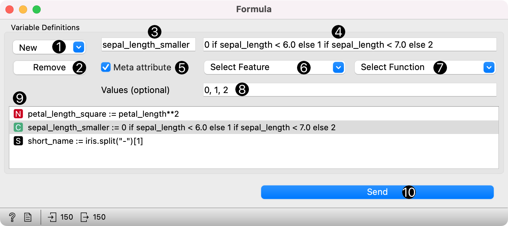

Formula
=======

Add new features to your dataset.

**Inputs**

- Data: input dataset

**Outputs**

- Data: dataset with additional features

**Formula** allows computing new columns by combining the existing ones with a user-defined expression. The resulting column can be categorical, numerical, textual, or datetime.
For numeric variables, it sufices to provide a name and an expression.

1. Add new variable.
2. Remove selected variable.
3. New variable name.
4. Expression in Python.
5. If checked, the option will place selected variable in metas.
6. Select a feature.
7. Select a function.
8. Assign values to categorical variables.
9. A list of new variables.
10. Press *Send* to communicate changes.

Example
-------

Here is a short example using the *iris* data set from the [File](../data/file.md) widget. We constructed three new variables, one numeric, one categorical, and one textual. For the numeric variable, we computed a square of *petal length* using the expression `petal_length**2`. For the categorical variable, we mapped *sepal length* to three new categories using the expression `0 if sepal_length < 6 else 1 if sepal_length < 7 else 2`. We also mapped the newly-created bins to values 0, 1, and 2. Finally, for the text variable, we removed the redundant *iris* label from class values, retaining only the species name using the expression `iris.split("-")[1]`.

We can observe the changes in a [Data Table](../data/datatable.md) widget.

#### Python math language

If you are unfamiliar with Python math language, here's a quick introduction.
Expressions can use the following operators:
- `+`, `-`, `*`, `/`: addition, subtraction, multiplication, division
- `//`: integer division
- `%`: remainder after integer division
- `**`: exponentiation (for square root square by 0.5)
- `<`, `>`, `<=`, `>=` less than, greater than, less or equal, greater or equal
- `==` equal
- `!=` not equal
- if-else: *value* `if` *condition* else *other-value* (see the above example)

See more [here](http://www.tutorialspoint.com/python/python_basic_operators.htm).
