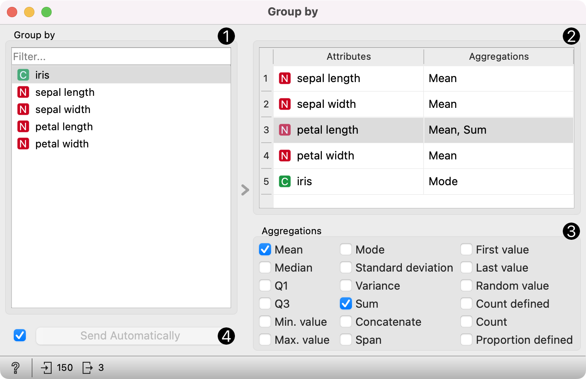
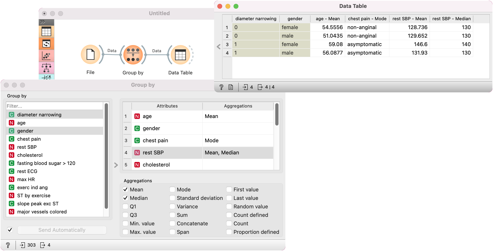

Group by
========

Groups data by selected variables and aggregate columns with selected aggregations.

**Inputs**

- Data: input data table

**Outputs**

- Data: aggregated data

First, the Group By widget identifies groups based on selected variables in the **Group by** list. Groups are defined by all distinct combinations of values in selected variables.

In the second step, the widget computes aggregations defined in the table on the right side of the widget for each group.

1. Select variables that define groups.
2. View variables and their aggregations. To change aggregation for one or more variables, select them from the list.
3. Change aggregations for variables selected in the view above. Note that numeric, categorical, and string values have different aggregation options.
4. When the *Send automatically* box is ticked, all changes will be automatically communicated to other widgets.

Example
-------

We first load *heart_disease* dataset in the [File](../data/file.md) widget. In the **Group By** widget, we set variables that define groups: *diameter narrowing* and *gender*. Each group includes items (rows) that belong to one combination of both variables. 

In the table on the right-hand side of the widget, first deselect the default *mean/mode* option for all. Next, we set that we want to compute mean for values of *age* variable in each group, mode for values of *chest pain* variable, and mean and median for *rest SBP*.

In the [Data Table](../data/datatable.md) widget, we can see that both females and males have lower average values for *rest SBP* when diameter narrowing is 0. The difference is greater for females. The median of *rest SBP* is different only for females, while for males is the same.

You can also observe differences between mean *ages* and the most frequent value (mode) of *chest pain* between groups.

