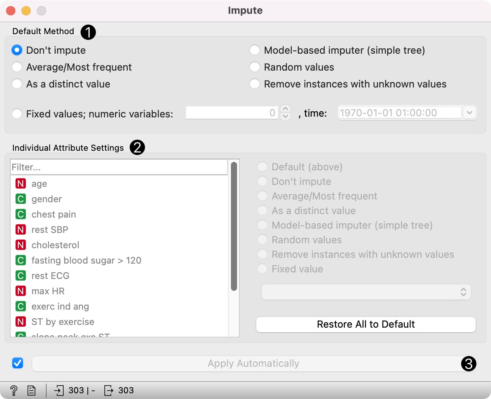
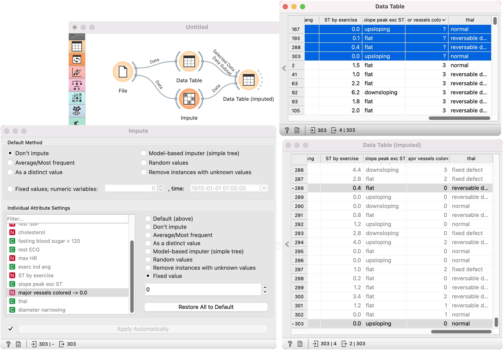

Impute
======

Replaces unknown values in the data.

**Inputs**

- Data: input dataset
- Learner: learning algorithm for imputation

**Outputs**

- Data: dataset with imputed values

Some Orange's algorithms and visualizations cannot handle unknown values in the data. This widget does what statisticians call imputation: it substitutes missing values by values either computed from the data or set by the user. The default imputation is mean.

1. In the *Default method* box, the user can specify a general imputation technique for all attributes.
   - *Don't Impute* does nothing with the missing values.
   - *Average/Most-frequent* uses the average (for continuous attributes) or the most common value (for discrete attributes).
   - *As a distinct value* creates new features defining whether an instance had missing values for the unimputed feature.
   - *Model-based imputer* constructs a simple tree model for predicting the missing value, based on values of other attributes; a separate model is constructed for each attribute. The default model is 1-NN learner, which takes the value from the most similar example (this is sometimes referred to as hot deck imputation). This algorithm can be substituted by one that the user connects to the input signal *Learner*. Note, however, that if there are discrete and continuous attributes in the data, the algorithm needs to be capable of handling them both; at the moment only 1-NN learner can do that. (In the future, when Orange has more regressors, the Impute widget may have separate input signals for discrete and continuous models.)
   - *Random values* computes the distributions of values for each attribute and then imputes by picking random values from them.
   - *Remove instances with unknown values* removes the example containing missing values. This check also applies to the class attribute if *Impute class values* is checked.
   - *Fixed values* assigns the values provided by the user. Separate values have to be set for numeric and time variables.

2. It is possible to specify individual treatment for each attribute, which overrides the default treatment for a given attribute. One can also specify a manually defined value used for imputation.
*Restore All to Default* resets the individual attribute treatments to default.
3. All changes are committed immediately if *Apply Automatically* is checked. Otherwise, *Apply* needs to be ticked to apply any new settings.

Example
-------

To demonstrate how the **Impute** widget works, we selected the *heart_disease* dataset, which contains some missing values in the *major vessels colored* feature. We show those four attributes in [Data Table](../data/datatable.md).

We used the **Impute** widget and selected the *Fixed valuer* to impute the missing values only for the *major vessels colored* attribute. In Data Table (imputed), we see how the question marks turned into 0, which was our choice for a fixed value.

