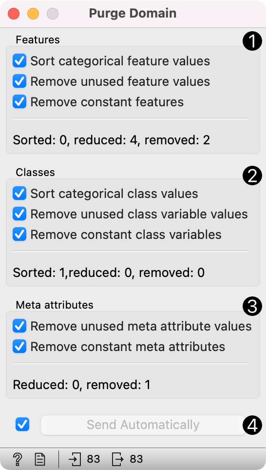
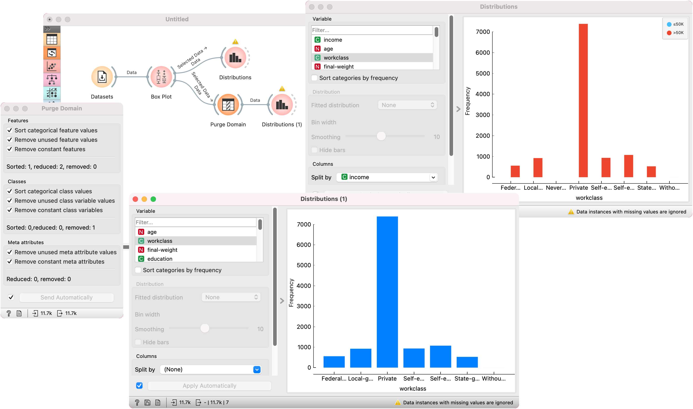

Purge Domain
============

Removes unused attribute values and useless attributes, sorts the remaining values.

**Inputs**

- Data: input dataset

**Outputs**

- Data: filtered dataset

Definitions of nominal attributes sometimes contain values which don’t appear in the data. Even if this does not happen in the original data, filtering the data, selecting exemplary subsets and alike can remove all examples for which the attribute has some particular value. Such values clutter data presentation, especially in various visualizations, and should be removed.

After purging an attribute, it may become single-valued or, in extreme case, have no values at all (if the value of this attribute was undefined for all examples). In such cases, the attribute can be removed.

A different issue is the order of attribute values: if the data is read from a file in a format in which values are not declared in advance, they are sorted "in order of appearance". Sometimes we would prefer to have them sorted alphabetically.

1. Purge attributes.
2. Purge classes.
3. Purge meta attributes.
4. Information on the filtering process.
5. Produce a report.
6. If *Apply automatically* is ticked, the widget will output data at
   each change of widget settings.

Such purification is done by the widget **Purge Domain**. Ordinary attributes and class attributes are treated separately. For each, we can decide if we want the values sorted or not. Next, we may allow the widget to remove attributes with less than two values or remove the class attribute if there are less than two classes. Finally, we can instruct the widget to check which values of attributes actually appear in the data and remove the unused values. The widget cannot remove values if it is not allowed to remove the attributes, since having attributes without values makes no sense.

The new, reduced attributes get the prefix “R”, which distinguishes them from the original ones. The values of new attributes can be computed from the old ones, but not the other way around. This means that if you construct a classifier from the new attributes, you can use it to classify the examples described by the original attributes. But not the opposite: constructing a classifier from the old attributes and using it on examples described by the reduced ones won’t work. Fortunately, the latter is seldom the case. In a typical setup, one would explore the data, visualize it, filter it, purify it… and then test the final model on the original data.

Example
-------

The **Purge Domain** widget would typically appear after data filtering, for instance when selecting a subset of visualized examples.

In the workflow below, we show the *adult.tab* dataset from the [Datasets](../data/datasets.md) widget. We visualize it and select instances with income >50k. Incidentally, one group in the *workclass* doesn't contain any samples with income higher than 50k.

To get rid of the empty category, we put the data through **Purge Domain** before going on to the [Distributions](../visualize/distributions.md) widget. The latter shows only the seven categories which are in the **Purge Data** output. To see the effect of data purification, observe the data after [Box Plot](../visualize/boxplot.md) in another Distributions widget.

