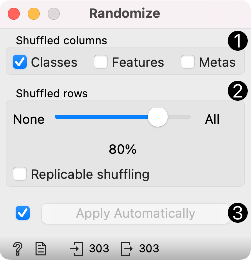
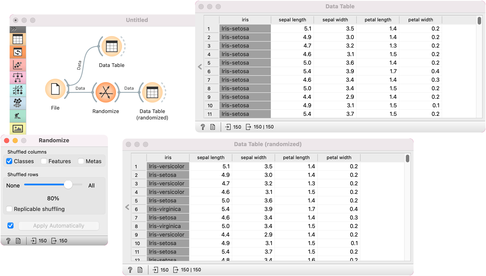
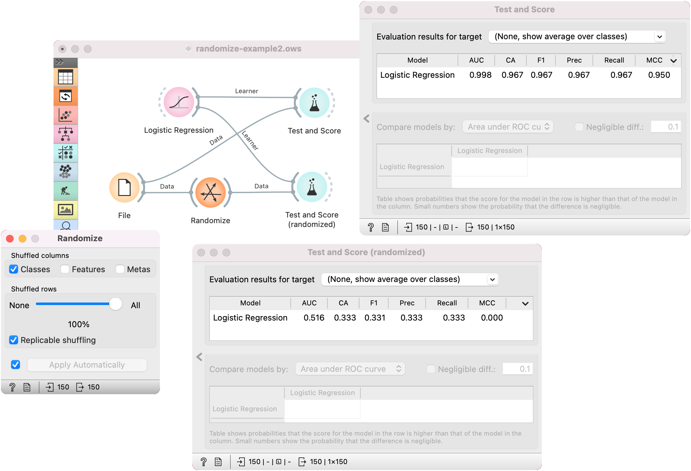

Randomize
=========

Shuffles classes, attributes and/or metas of an input dataset.

**Inputs**

- Data: input dataset

**Outputs**

- Data: randomized dataset

The **Randomize** widget receives a dataset in the input and outputs the same dataset in which the classes, attributes or/and metas are shuffled.

{width=50%}

1. Select group of columns of the dataset you want to shuffle.
2. Select proportion of the dataset you want to shuffle.
   *Replicable shuffling* produces replicable output.
3. If *Apply automatically* is ticked, changes are committed automatically. Otherwise, press *Apply* after each change.

Examples
--------

The **Randomize** widget is usually placed right after the [File](../data/file.md) widget. The basic usage is shown in the following workflow, where values of class variable of the *iris* dataset are randomly shuffled.

In the next example, we show how shuffling class values influences [Logistic Regression](../model/logisticregression.md) performance in the [Test and Score](../evaluate/testandscore.md) widget on the same dataset as above.

