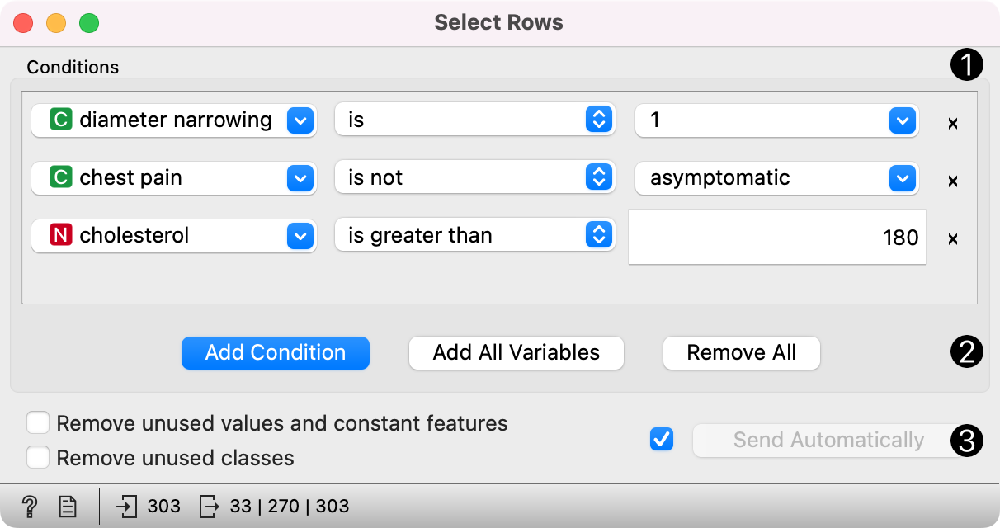
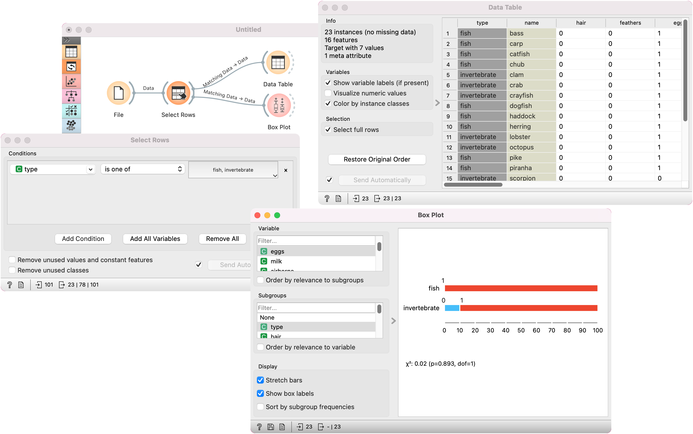

Select Rows
===========

Selects data instances based on conditions over data features.

**Inputs**

- Data: input dataset

**Outputs**

- Matching Data: instances that match the conditions
- Non-Matching Data: instances that do not match the conditions
- Data: data with an additional column showing whether a instance is selected

This widget selects a subset from an input dataset, based on user-defined conditions. Instances that match the selection rule are placed in the output *Matching Data* channel.

Criteria for data selection are used with AND operation, meaning the selected items are those matching ALL the terms in '*Conditions*'.

Condition terms are defined through selecting an attribute, selecting an operator from a list of operators, and, if needed, defining the value to be used in the condition term. Operators are different for discrete, continuous and string attributes.

1. Conditions you want to apply, their operators and related values.
2. *Add Condition*: Add a new condition to the list of conditions. *Add All Variables*: Add all the possible variables at once. *Remove All*: Remove all the listed variables at once.
3. *Remove unused values and constant features* removes redundant values in the domain and features with constant values. *Remove unused classes* removes unused or constant class values. When the *Send automatically* box is ticked, all changes will be automatically communicated to other widgets.

Example
-------

In the workflow below, we used the *Zoo* data from the [File](../data/file.md) widget and fed it into the **Select Rows** widget. In the widget, we chose to output only two animal types, namely fish and invertebrate. We can inspect the dataset with selected rows in the [Data Table](../data/datatable.md) widget and observe distributions on a subset using the [Box Plot](../visualize/boxplot.md) widget.

