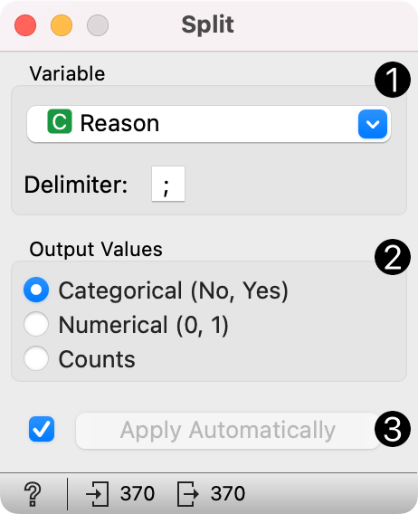

Split
=====

Split text or categorical variables into indicator variables.

**Inputs**

- Data: data table

**Outputs**

- Data: data table with added columns

The widget splits a user-defined text or categorical variable into separate variables. The newly-created variables can be categorical (with Yes and No values), numeric (with 0 and 1 values), or counted (if a given value appears more than once). The widget is typically used with survey data.

{width=40%}

1. Select the variable to split on. Define the delimiter.
2. Set the type of output variables. Categorical returns Yes/No values, numerical 0/1, while Counts returns counts (the same as Counter function in Python).
3. If *Apply Automatically* is ticked, changes are communicated automatically. Alternatively, press *Apply*.

Example
-------

The workflow uses data from the Orange survey taken in 2020. The survey was done in Google Forms, which joins responses for multiple choice questions.

To use this data in the analysis, we have to split on a delimiter, a semicolon in this case. We do this using **Split**. We pass the data from the [File](../data/file.md) widget to Split and set the parameters.

Say, we wish to observe and count the reasons users like Orange. We split on *Reason* and set the delimiter to semicolon. The output will be an array of categorical variables. We can observe the results in a [Data Table](../data/datatable.md).

The advantage of Split is that now, we can count each response individually. Say, we observe how the responses differ on the position of the respondent in [Box Plot](../visualize/boxplot.md). It seem the professors especially appreciate Orange for its visual programming approach.

{width=500px}