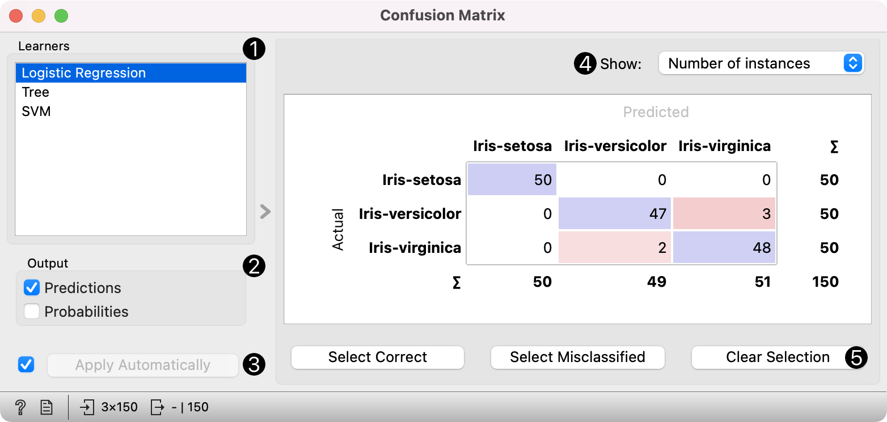
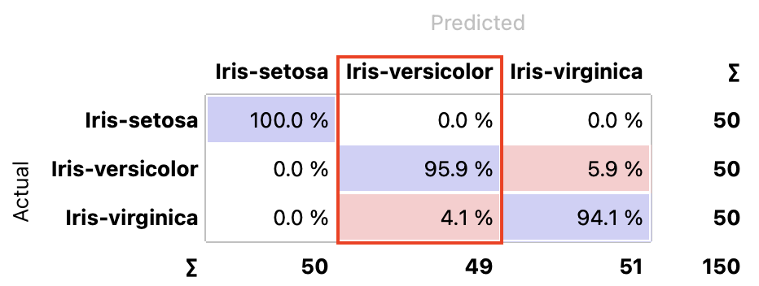
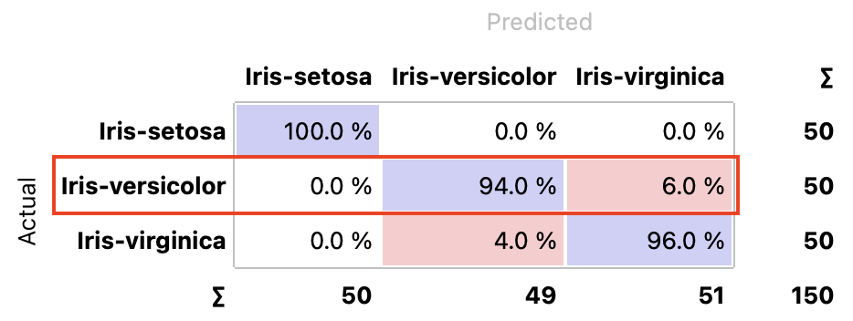

Confusion Matrix
================

Shows proportions between the predicted and actual class.

**Inputs**

- Evaluation results: results of testing classification algorithms

**Outputs**

- Selected Data: data subset selected from confusion matrix
- Data: data with the additional information on whether a data instance was selected

The [Confusion Matrix](https://en.wikipedia.org/wiki/Confusion_matrix) gives the number/proportion of instances between the predicted and actual class. Each row corresponds to a correct class, while columns represent the predicted classes. The rightmost column gives the number of instances from each class and the bottom row gives the number of instances classified into each class.

The selection of the elements in the matrix feeds the corresponding instances into the output signal. This way, one can observe which specific instances were misclassified and how.

The widget usually gets the evaluation results from [Test and Score](../evaluate/testandscore.md); an example of the schema is shown below.

1. *Learners*: Choose a learning algorithm to display.
2. *Output*: define what is sent to the output, namely predicted classes (*Predictions*) or their probabilities (*Probabilities*).
3. The widget outputs every change if *Send Automatically* is ticked. If not, the user will need to click *Send Selected* to commit the changes.
4. *Show*: select what data to see in the matrix.
   - **Number of instances** shows correctly and incorrectly classified instances numerically.
   - **Proportions of predicted** shows how many instances classified as, say, *Iris-versicolor* are in which true class; in the table we can read the 0% of them are actually setosae, 95.9% of those classified as versicolor are versicolors, and 4.1% are virginicae.
   
   - **Proportions of actual** shows the opposite relation: of all true versicolors, 94% were classified as versicolors and 6% as virginicae.
   
   - **Sum of probabilities** sums the probabilities for each class. For example, there are 50 iris-setosas. This option sums probabilities for all *actual* versicolors to belong to iris-setosa (1.4), to iris-versicolor (41.4), and to iris-virginica (7.2).
   
5. Select the desired output:
   - **Select Correct** sends all correctly classified instances to the output by selecting the diagonal of the matrix.
   - **Select Misclassified** selects the misclassified instances.
   - **Clear Selection** annuls the selection.
   As mentioned before, one can also select individual cells of the table to select specific kinds of misclassified instances.

Example
-------

The following workflow demonstrates what this widget can be used for. We are using the *iris* dataset for demonstration.

[Test and Score](../evaluate/testandscore.md) gets the data from [File](../data/file.md) and a learning algorithm, [Naive Bayes](../model/naivebayes.md). It performs cross-validation or some other train-and-test procedures to get class predictions for all (or some) data instances. The test results are fed into the **Confusion Matrix**, where we can observe how many instances were misclassified and in which way.

In the output, we used [Scatter Plot](../visualize/scatterplot.md), which gets two sets of data, the whole dataset from the File widget, and a subset from Confusion Matrix. Now, we wish to show where the misclassifications lie in the Scatter Plot. We click *Misclassified*, which selects all the off-diagonal (misclassified) instances from the confusion matrix. The scatter plot will show all the data in a graph, with bold symbols representing the selected (misclassified) data points.
