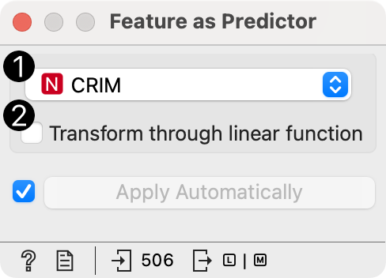
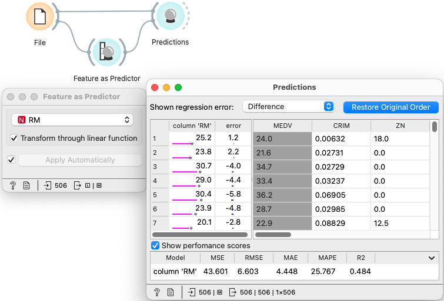
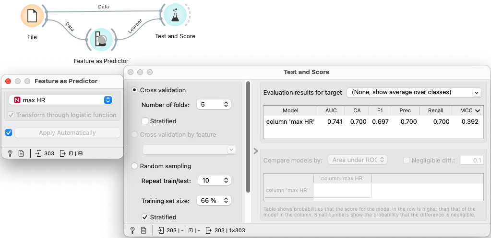

Feature as Predictor
====================

Constructs a model that uses a selected feature as a predictor.

**Inputs**

- Data: data table

**Outputs**

- Model: a model that uses the selected feature as a predictor
- Learner: a learning algorithm that trains such a model

The widget is useful in situations where we would like to test the predictive power of a single feature.

The target variable can be categorical or numeric. 

{width=244px}?

1. Select the feature. The widget limits the selection as follows. 

   - For binary target variables, the feature used as a predictor can be either numeric or categorical. Values of numeric features are treated as probabilities of the target class. If their range is not between 0 and 1, they are transformed through sigmoid function with fitted coefficients. If values are between 0 and 1, transformation is optional. If the feature is categorical, it must have the same values as the target variable.

   - For other target variables, the feature used must be categorical and must contain only values that are present in the target variable.

   - If the target variable is numeric, the feature must be numeric, too. It can be transformed with a linear regression model.

2. Enable transformation. When transformation is applied, the model constructed by the widget is equivalent to a logistic or linear regression model.

    This feature is disabled when the transformation is not applicable or enforced.

Examples
--------

Two groups, called "yellow" and "green" compete at distinguishing between the works of Monet and Manet. We can choose the group in Feature as Predictor and observe the usual classification results.

How well does the price of a house correlate with the number of rooms? Here we can (and must) enable transformation because the scale of the feature's values is very different from the scale of the target variable. Note that this measures the fit rather than predictive power because we do not test the model on unseen data.

How well can we predict the heart disease based on the maximal heart rate? Here we connect the *Feature as Predictor* widget to the *Test and Score* widget to evaluate the model on unseen data. In this case, Feature as Predictor provides a learning algorithm that fits a logistic regression model to the feature's values.

