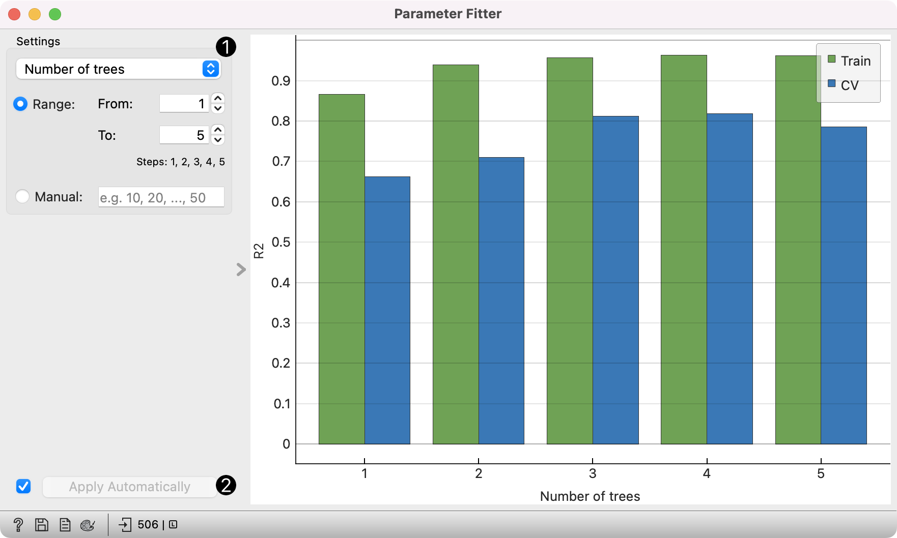
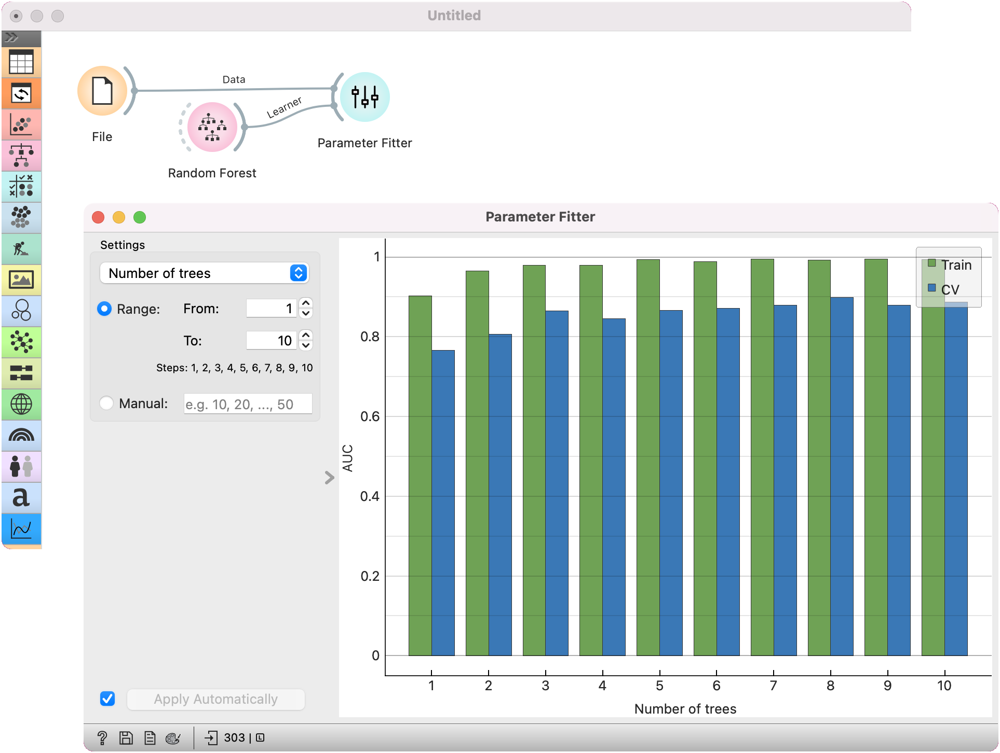

Parameter Fitter
================

Find the best hyper-parameters for a model.

**Inputs**

- Data: input data
- Learner: learning algorithm

Parameter fitter shows performance of a learning algorithms with different settings of a hyper-parameter. The widget is currently limited to a single integer parameter. Not all learning algorithms support hyper-parameter tuning (currently, only [Random Forest](../model/randomforest.md) and [PLS](../model/pls.md)). The widget shows a plot of the model's performance at different values of the parameter. The graph shows AUC for classification problems and R2 for regression.

1. Choose the parameter to fit.
   *Range*: Define the lower and the upper limit; step size is determined automatically.
   *Manual*: Alternatively, specify the values for the parameter. The widget also accepts `...`, e.g. `1, 2, 3, ..., 10` or `40, 60, ..., 100`. When the parameter has a minimal value (e.g. the number of components cannot be negative), one can also omit the lower bound, e.g. `..., 80, 100`; and if the parameter has a maximal value, one can omit the upper bound, e.g. `2, 4, 6, ...,`.
2. If *Apply Automatically* is ticked, changes are communicated automatically. Alternatively, click *Apply*.

Example
-------

Here is a simple example on how to fit parameters using the **Parameter Fitter** widget. We are using the *heart-disease* data for this example and loading it with the [File](../data/file.md) widget. We pass the data to Parameter Fitter. The widget also needs a learner to fit, the [Random Forest](../model/randomforest.md) in this case.

Parameter Fitter enables observing performance for a varying number of trees. We set the range from 1 to 10, namely we will observe performance for every number of trees up to 10.

We see there's a slight peak in AUC value for cross-validation at 3 trees, while 8 trees seem to be optimal overall. (Note that this is just a toy example!)

