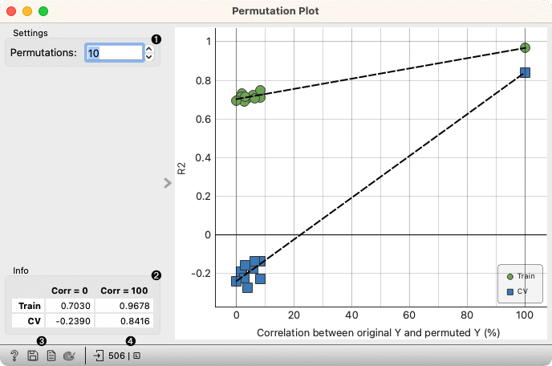
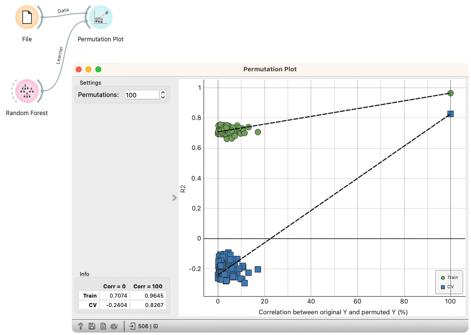

Permutation Plot
================

Check the validity and the degree of overfit for the input learner.

**Inputs**

- Data: input dataset
- Learner: learning algorithm

1. Select the number of permutation. The target variable is randomly permuted and separate learners are fitted to all the permuted y-variables.
2. Information on the model performance.
3. Get help, save the plot, make the report, set plot properties.
4. Observe the size and type of inputs.

The Permutation plot displays the correlation coefficient between the original y-variable and the permuted y-variable on the x-axis versus the cumulative R2/AUC on the y-axis, and draws a regression line. The intercept is a measure of the overfit. 

Examples
--------

Here is a example on the housing data, where we analyze the performance of a [Random Forest](../model/randomforest.md) model.

