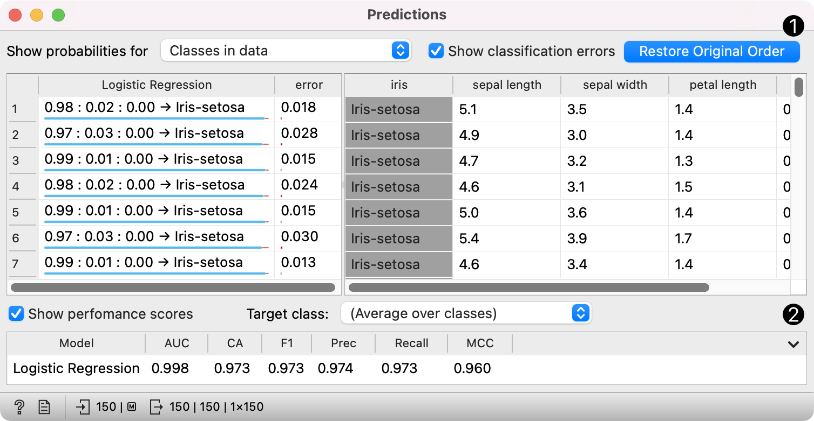
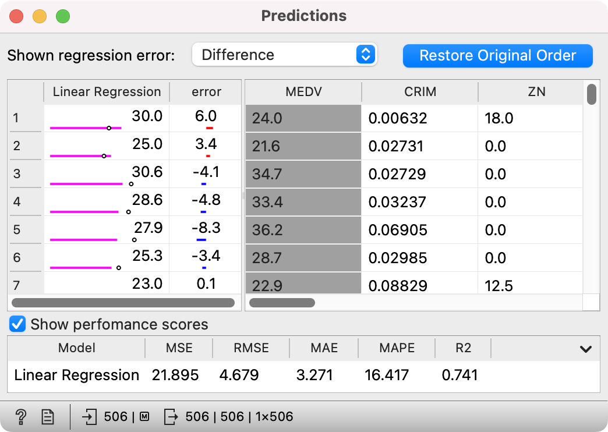
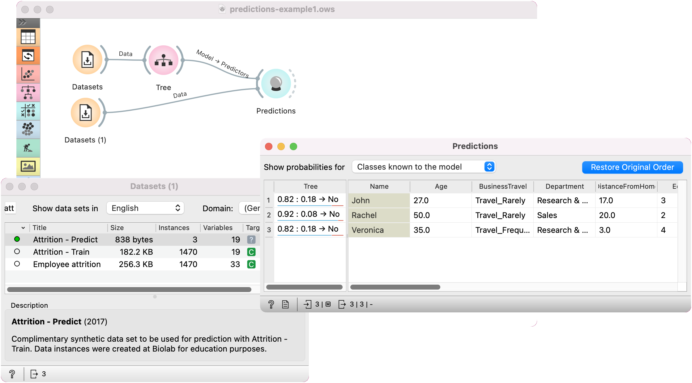
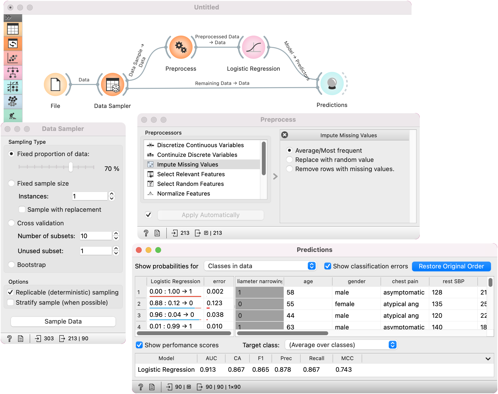

Predictions
===========

Shows models' predictions on the data.

**Inputs**

- Data: input dataset
- Predictors: predictors to be used on the data

**Outputs**

- Selected Predictions: a subset of predictions
- Predictions: data with added predictions
- Evaluation Results: results of testing classification algorithms

The widget receives a dataset and one or more predictors (predictive models, not learning algorithms - see the example below). It outputs the data and the predictions.

1. *Show probabilities for* enables showing different kinds of prediction probabilities, namely for classes in the data, for classes known to the model, or classes in data and model.
   If *Show classification errors* is ticked, an additional error column is shown, displaying 1 - probability assigned to the correct class.
   If you have sorted the data table by attribute and you wish to see the original view, press *Restore Original Order*.
2. *Show performance scores* shows scores for model comparison. For classification, one can set the *Target class* to compare scores on different classes. *(Average over classes)* averages individual class scores.

The widget show the probabilities and final decisions of [predictive models](https://en.wikipedia.org/wiki/Predictive_modelling). There are three widget outputs, namely another dataset, where predictions are appended as new meta attributes, a selected subset of enhanced dataset, or evaluation results (predicted data icnluding a true class values) to be used with [Confusion Matrix](../evaluate/confusionmatrix.md), [ROC Analysis](../evaluate/rocanalysis.md), [Performance Curve](../evaluate/performancecurve.md) or [Calibration Plot](../evaluate/calibrationplot.md).  Predictions can be observed in a [Data Table](../data/datatable.md) or analyzed downstream.

For regression, the widget shows different types of regression errors, namely *Difference* (to true value), *Absolute difference*, *Relative difference* (in percentage), and *Absolute relative*. Note that "positive" differences (overestimations) are shown in red, while "negative" differences (underestimations) are shown in blue.

On the left side, a pink line indicates the forecast value, while the dot indicates a true value. This, along with the error column, allows for a quick visual estimation of predictive errors.

Examples
--------

#### Predict on new data

In the first example, we will use *Attrition - Train* data from the [Datasets](../data/datasets.md) widget. This is a data on attrition of employees. In other words, we wish to know whether a certain employee will resign from the job or not. We will construct a predictive model with the [Tree](../model/tree.md) widget and observe probabilities in **Predictions**.

For predictions we need both the training data, which we have loaded in the first **Datasets** widget and the data to predict, which we will load in another [Datasets](../data/datasets.md) widget. We will use *Attrition - Predict* data this time. Connect the second data set to **Predictions**. Now we can see predictions for the three data instances from the second data set.

The [Tree](../model/tree.md) model predicts none of the employees will leave the company. You can try other model and see if predictions change. Or test the predictive scores first in the [Test & Score](../evaluate/testandscore.md) widget.

#### How to use preprocessing

In the second example, we will see how to properly use [Preprocess](../data/preprocess.md) with **Predictions** or [Test &andScore](../evaluate/testandscore.md).

This time we are using the *heart disease.tab* data from the [File](../data/file.md) widget. You can access the data through the dropdown menu. This is a dataset with 303 patients that came to the doctor suffering from a chest pain. After the tests were done, some patients were found to have diameter narrowing and others did not (this is our class variable).

The heart disease data have some missing values and we wish to account for that. First, we will split the data set into train and test data with [Data Sampler](../data/datasampler.md), say 70% for training and 30% for testing.

Then we will send the *Data Sample* into [Preprocess](../data/preprocess.md). We will use *Impute Missing Values*, but you can try any combination of preprocessors on your data. We will send *Preprocessed Data* to [Logistic Regression](../model/logisticregression.md) and the constructed model to **Predictions**.

Finally, **Predictions** also needs the data to predict on. We will use the output of [Data Sampler](../data/datasampler.md) for prediction, but this time not the *Data Sample*, but the *Remaining Data*, this is the data that wasn't used for training the model.

Notice how we send the remaining data directly to **Predictions** without applying any preprocessing. This is because Orange handles preprocessing on new data internally to prevent any errors in the model construction. The exact same preprocessor that was used on the training data will be used for predictions. The same process applies to [Test and Score](../evaluate/testandscore.md).

