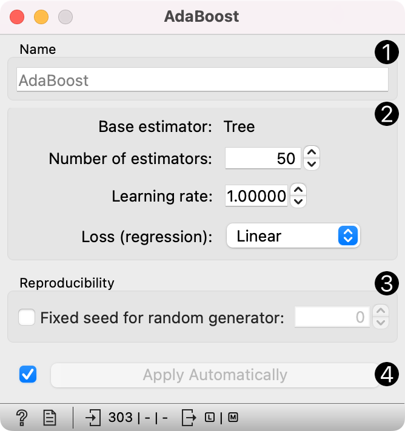

AdaBoost
========

An ensemble meta-algorithm that combines weak learners and adapts to the 'hardness' of each training sample.

**Inputs**

- Data: input dataset
- Preprocessor: preprocessing method(s)
- Learner: learning algorithm

**Outputs**

- Learner: AdaBoost learning algorithm
- Model: trained model

The [AdaBoost](https://en.wikipedia.org/wiki/AdaBoost) (short for "Adaptive boosting") widget is a machine-learning algorithm, formulated by [Yoav Freund and Robert Schapire](https://cseweb.ucsd.edu/~yfreund/papers/IntroToBoosting.pdf). It can be used with other learning algorithms to boost their performance. It does so by tweaking the weak learners.

**AdaBoost** works for both classification and regression.

{width=300px}

1. The learner can be given a name under which it will appear in other widgets. The default name is "AdaBoost".
2. Set the parameters. The base estimator is a tree and you can set:
   - *Number of estimators*
   - *Learning rate*: it determines to what extent the newly acquired information will override the old information (0 = the agent will not learn anything, 1 = the agent considers only the most recent information)
   - *Loss (regression)*: Regression loss function (if regression on input). It can be linear, square, or exponential.
3. *Fixed seed for random generator*: set a fixed seed to enable reproducing the results.
4. Click *Apply* after changing the settings. That will put the new learner in the output and, if the training examples are given, construct a new model and output it as well. To communicate changes automatically tick *Apply Automatically*.

Preprocessing
-------------

AdaBoost uses default preprocessing when no other preprocessors are given. It executes them in the following order:

- removes instances with unknown target values
- continuizes categorical variables (with one-hot-encoding)
- removes empty columns
- imputes missing values with mean values

To remove default preprocessing, connect an empty [Preprocess](../data/preprocess.md) widget to the learner.

Example
-------

We loaded the *iris* dataset with the [File](../data/file.md) widget. We used *AdaBoost* to boost the [Random Forest](../model/randomforest.md) model. We compare and evaluate the models' performance in [Test & Score](../evaluate/testandscore.md).

