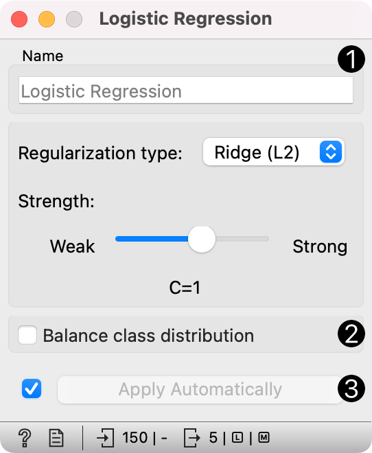
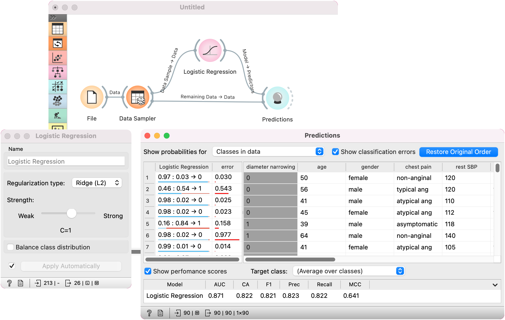

Logistic Regression
===================

The logistic regression classification algorithm with LASSO (L1) or ridge (L2) regularization.

**Inputs**

- Data: input dataset
- Preprocessor: preprocessing method(s)

**Outputs**

- Learner: logistic regression learning algorithm
- Model: trained model
- Coefficients: logistic regression coefficients

**Logistic Regression** learns a [logistic regression](https://en.wikipedia.org/wiki/Logistic_regression) model from the data. It only works for classification tasks.

{width=300px}

1. A name under which the learner appears in other widgets. The default name is "Logistic Regression".
2. [Regularization](https://en.wikipedia.org/wiki/Regularization_(mathematics)) type (either [L1](https://en.wikipedia.org/wiki/Least_squares#Lasso_method) or [L2](https://en.wikipedia.org/wiki/Ridge_regression)). Set the cost strength (default is C=1).
3. Press *Apply* to commit changes. If *Apply Automatically* is ticked, changes will be communicated automatically.

Preprocessing
-------------

Logistic Regression uses default preprocessing when no other preprocessors are given. It executes them in the following order:

- removes instances with unknown target values
- continuizes categorical variables (with one-hot-encoding)
- removes empty columns
- imputes missing values with mean values

To remove default preprocessing, connect an empty [Preprocess](../data/preprocess.md) widget to the learner.

Feature Scoring
---------------

Logistic Regression can be used with Rank for feature scoring. See [Learners as Scorers](../../learners-as-scorers/index.md) for an example.

Examples
--------

The widget is used just as any other widget for training a classifier. This is an example demonstrating prediction results with logistic regression on the *heart_disease* dataset. We first load *heart_disease* in the [File](../data/file.md) widget and pass it to [Data Sampler](../data/datasampler.md), which splits the data at 70:30 ratio. Then we pass the *Data Sample* to **Logistic Regression** and the trained model to [Predictions](../evaluate/predictions.md).

Now we want to predict class value on a left-out subset. We connect the *Remaining Data* output from the File widget to **Predictions**. We can now observe class values predicted with **Logistic Regression** directly in **Predictions**.

The logistic regression model can also be explained with the [Nomogram](../visualize/nomogram.md) widget. Train the model by connecting *heart_disease* data from the File widget to Logistic Regression. Then, pass the trained model to Nomogram, which shows feature importance and enables interactive exploration.

