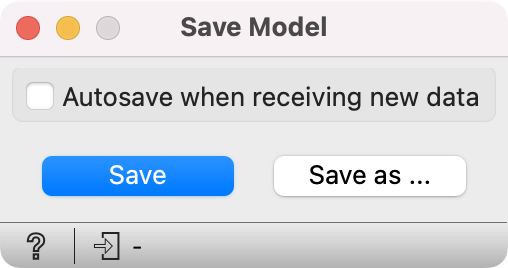

Save Model
==========

Save a trained model to an output file.

If the file is saved to the same directory as the workflow or in the subtree of that directory, the widget remembers the relative path. Otherwise it will store an absolute path, but disable auto save for security reasons. All models are saved in a .pickle format (.pkcls).

**Inputs**

- Model: trained model

{width=50%}

1. If *Autosave when receiving new data*, the previously saved model will be overwritten when input model is updated.
2. *Save* the created model. The model will be saved to a pickled file.
3. *Save as...* enables specifying the name of the file. 

Example
-------

When you want to save a custom-set model, feed the data to the model (e.g. [Logistic Regression](../model/logisticregression.md)) and connect it to **Save Model**. Load it later into workflows with [Load Model](../model/loadmodel.md). Datasets used with **Load Model** have to contain compatible attributes.

