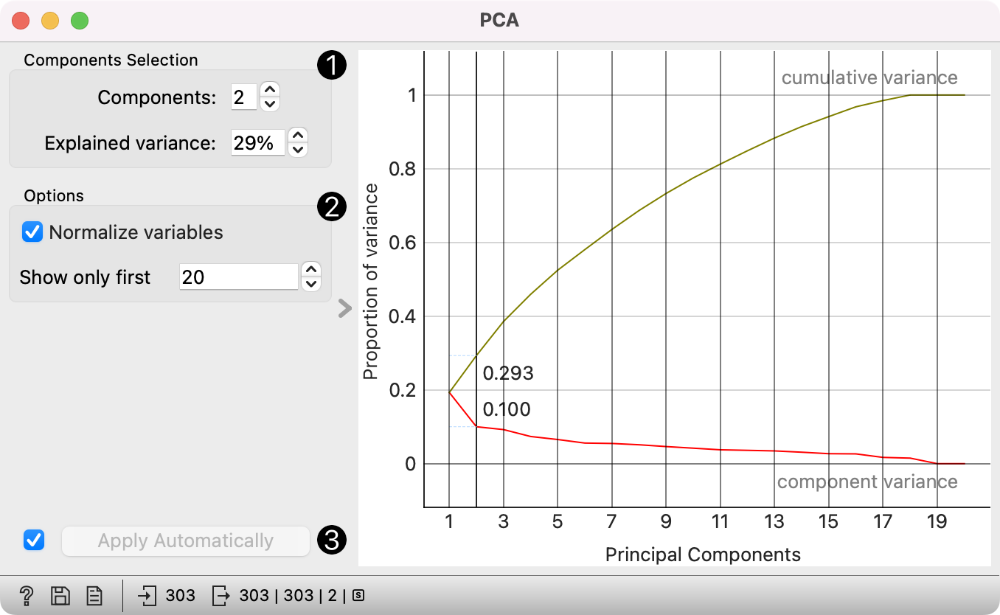
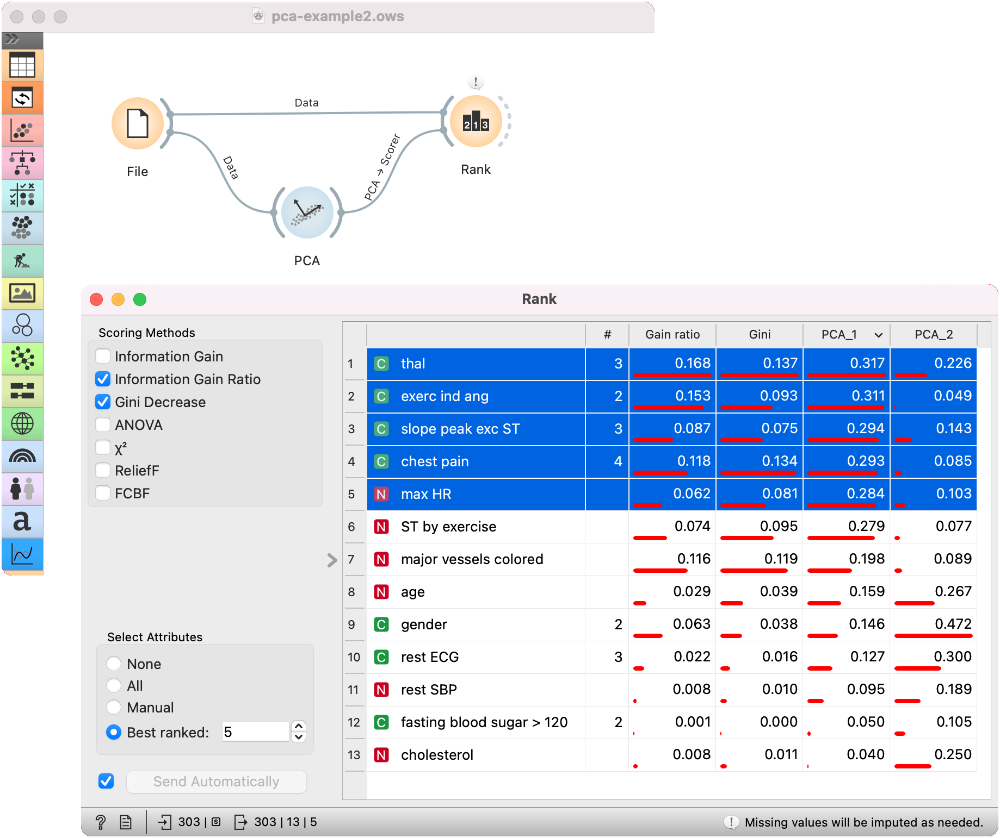

PCA
===

PCA linear transformation of input data.

**Inputs**

- Data: input dataset

**Outputs**

- Transformed Data: PCA transformed data
- Data: original data with PCA components as meta variables
- Components: [Eigenvectors](https://en.wikipedia.org/wiki/Eigenvalues_and_eigenvectors)
- PCA: PCA to use as Scorer in [Rank](../data/rank.md)

[Principal Component Analysis](https://en.wikipedia.org/wiki/Principal_component_analysis) (PCA) computes the PCA linear transformation of the input data. It outputs either a transformed dataset with weights of individual instances or weights of principal components.

{width=500px}

1. Select how many principal components you wish in your output. It is best to choose as few as possible with variance (parameter *Explained variance*) covered as high as possible. You can also set how much variance you wish to cover with your principal components.
2. You can normalize data to adjust the values to common scale. If checked, columns are divided by their standard deviations. One can also set how many components to display in the graph.
3. When *Apply Automatically* is ticked, the widget will automatically communicate all changes. Alternatively, click *Apply*.

The principal components graph, called a scree plot, show the red (lower) line, representing the variance covered per component, and the green (upper) line, representing the cumulative variance covered by components. The number of components of the transformation can be selected either in the *Components* input box or by dragging the vertical cutoff line in the graph.

Preprocessing
-------------

The widget preprocesses the input data in the following order:

- continuizes categorical variables (with one-hot-encoding)
- imputes missing values with mean values
- if *Normalize variables* is checked, it divides columns by their standard deviation.

Examples
--------

**PCA** can be used to simplify visualizations of large datasets. Below, we used the *Iris* dataset to show how we can improve the visualization of the dataset with PCA. The transformed data in the [Scatter Plot](../visualize/scatterplot.md) show a much clearer distinction between classes than the default settings.

PCA can also be used as a scorer for the [Rank](../data/rank.md) widget. We used the *iris* data for this example. The data is passed both to Rank and to PCA. PCA passes the Scorer output to the Rank widget. Rank now shows feature scores for the first two principal components.

