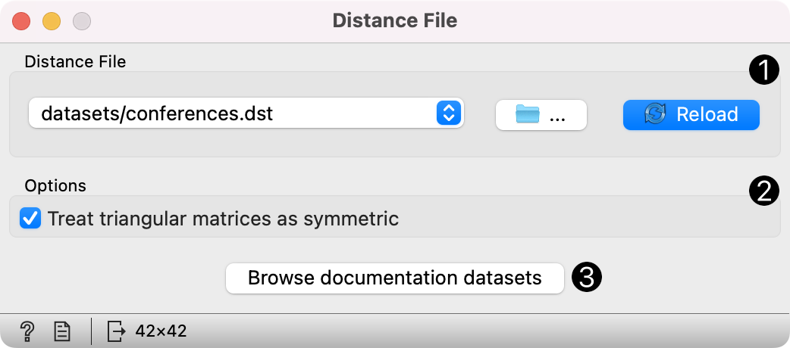
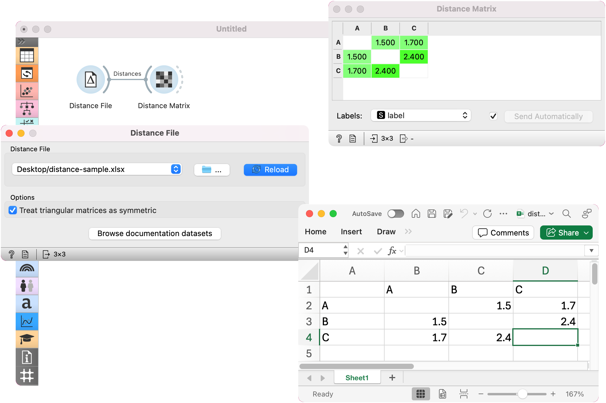

Distance File
=============

Loads an existing distance file.

**Outputs**

- Distance File: distance matrix

{width=400px}

1. Choose from a list of previously saved distance files.
   Browse for saved distance files.
   Reload the selected distance file.
2. If *Treat triangular matrices as symmetric* is checked, triangular matrices will be mirrored over diagonal.
3. Browse documentation datasets.

The simplest way to prepare a distance file is to use Excel. The widget currently processes only single-sheet workbooks. The matrix can be either rectangular, or upper- or lower-triangular, with labels given for columns (immediately above) or rows (immediately to the left) or both. Empty cells are treated as zeros. If the matrix is triangular and only one set of labels is given or both sets are equal, the other half can be filled automatically, making the matrix symmetric.

{width=400px}

Above is an example of am upper-triangular matrix.

Example
-------

When you want to use a custom-set distance file that you've saved before, open the **Distance File** widget and select the desired file with the *Browse* icon. This widget loads the existing distance file. In the snapshot below, we loaded the test square matrix. We displayed the matrix in the [Distance Matrix](../unsupervised/distancematrix.md) widget.

