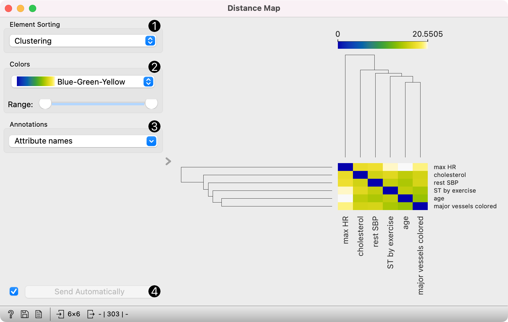
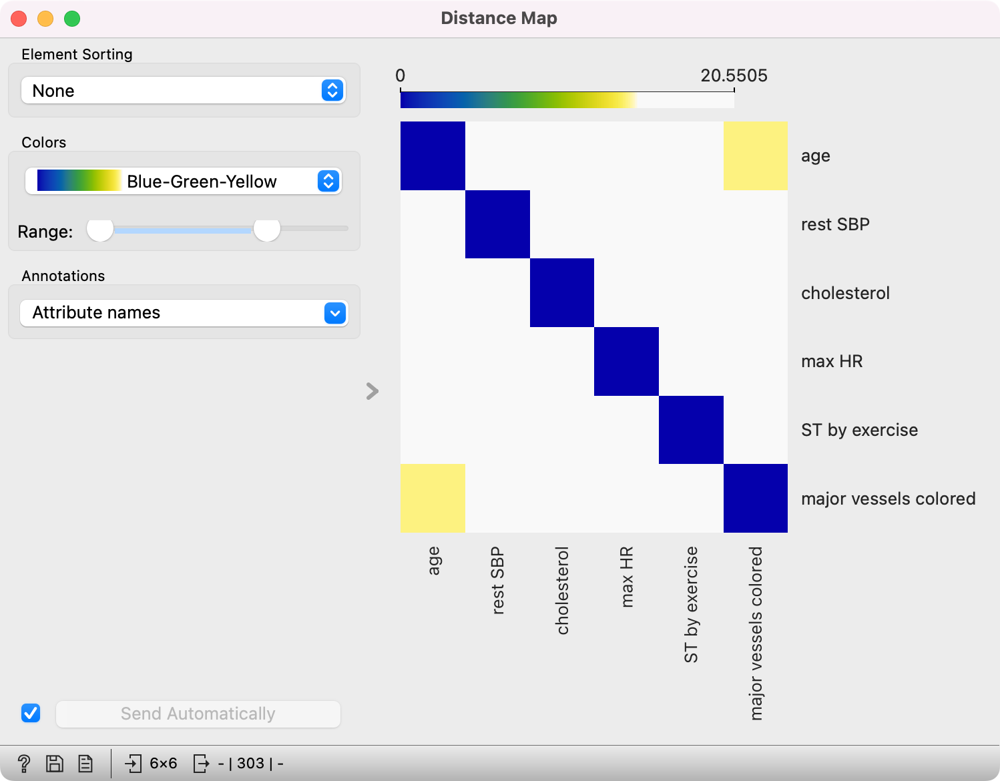
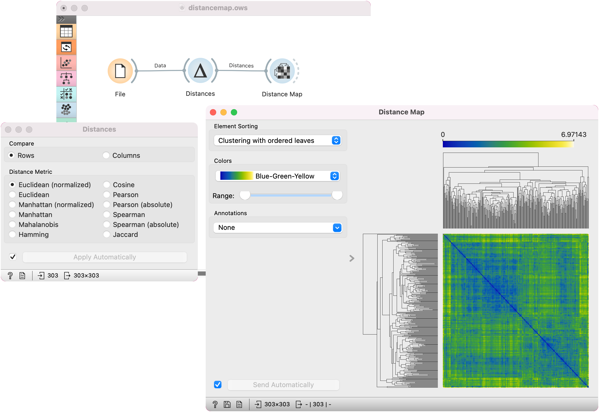

Distance Map
============

Visualizes distances between items.

**Inputs**

- Distances: distance matrix

**Outputs**

- Data: instances selected from the matrix
- Features: attributes selected from the matrix

The **Distance Map** visualizes distances between objects. The visualization is the same as if we printed out a table of numbers, except that the numbers are replaced by colored spots. Conceptually, it is similar to the [Heat Map](../visualize/heatmap.md) widget.

Distances are most often those between instances ("*rows*" in the [Distances](distances.md) widget) or attributes ("*columns*" in Distances widget). The two suitable inputs for **Distance Map** are the [Distances](distances.md) and the [Distance File](distancefile.md) widget. For the output, the user can select a region of the map and the widget will output the corresponding instances or attributes. Also note that the **Distances** widget ignores discrete values and calculates distances only for continuous data, thus it can only display distance map for discrete data if you [Continuize](../data/continuize.md) them first.

The snapshot shows distances between columns in the *heart_disease* data, where smaller distances are represented with blue and larger with yellow/white. The matrix is symmetric and the diagonal is blue - no attribute is different from itself. Symmetricity is always assumed, while the diagonal may also be non-zero.

{width=500px}

1. *Element sorting* arranges elements in the map by
   - None (lists instances as found in the dataset)
   - **Clustering** (clusters data by similarity)
   - **Clustering with ordered leaves** (maximizes the sum of similarities of adjacent elements)
2. *Colors*
   - **Colors** (select the color palette for your distance map)
   - **Range**: Define the low and high thresholds for the color palette (low for instances or attributes with low distances and high for instances or attributes with high distances).
3. Select *Annotations*.
4. If *Send Selected Automatically* is on, the data subset is communicated automatically, otherwise you need to press *Send Selected*.

Normally, a color palette is used to visualize the entire range of distances appearing in the matrix. This can be changed by setting the low and high threshold. In this way, we ignore the differences in distances outside this interval and visualize the interesting part of the distribution.

Below, we visualized the most correlated attributes (distances by columns) in the *heart_disease* dataset by lowering the color threshold for high distances. We get a predominantly white square, where attributes with the lowest distance scores are represented by blue. We see that, beside the diagonal line, *age* and *major vessels colored* are the two attributes closest together.

{width=400px}

The user can select a region in the map with the usual click-and-drag of the cursor. When a part of the map is selected, the widget outputs all items from the selected cells.

Example
-------

The workflow shows a very standard use of the **Distance Map** widget. We select the *Iris* data and view the distances between rows in **Distance Map**.

