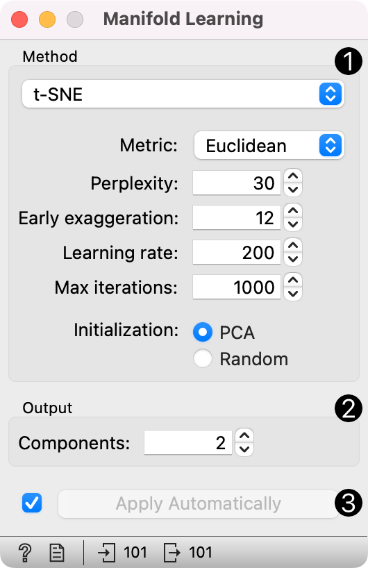
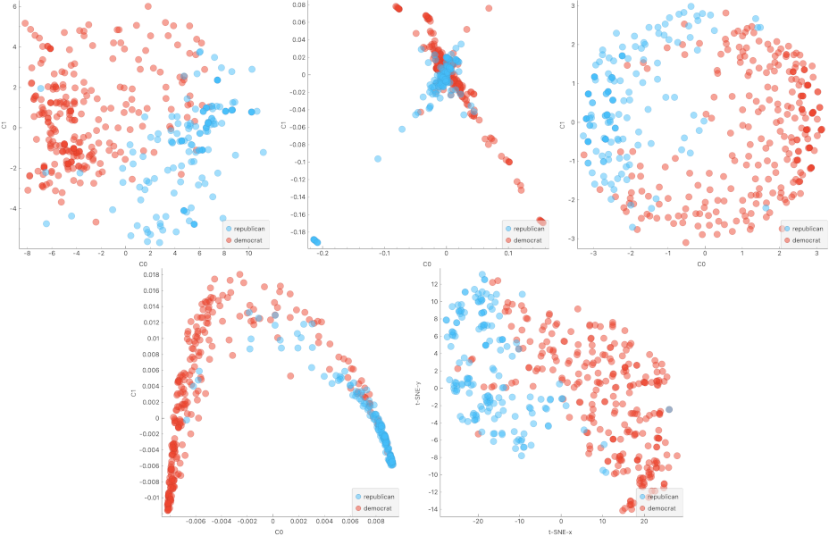
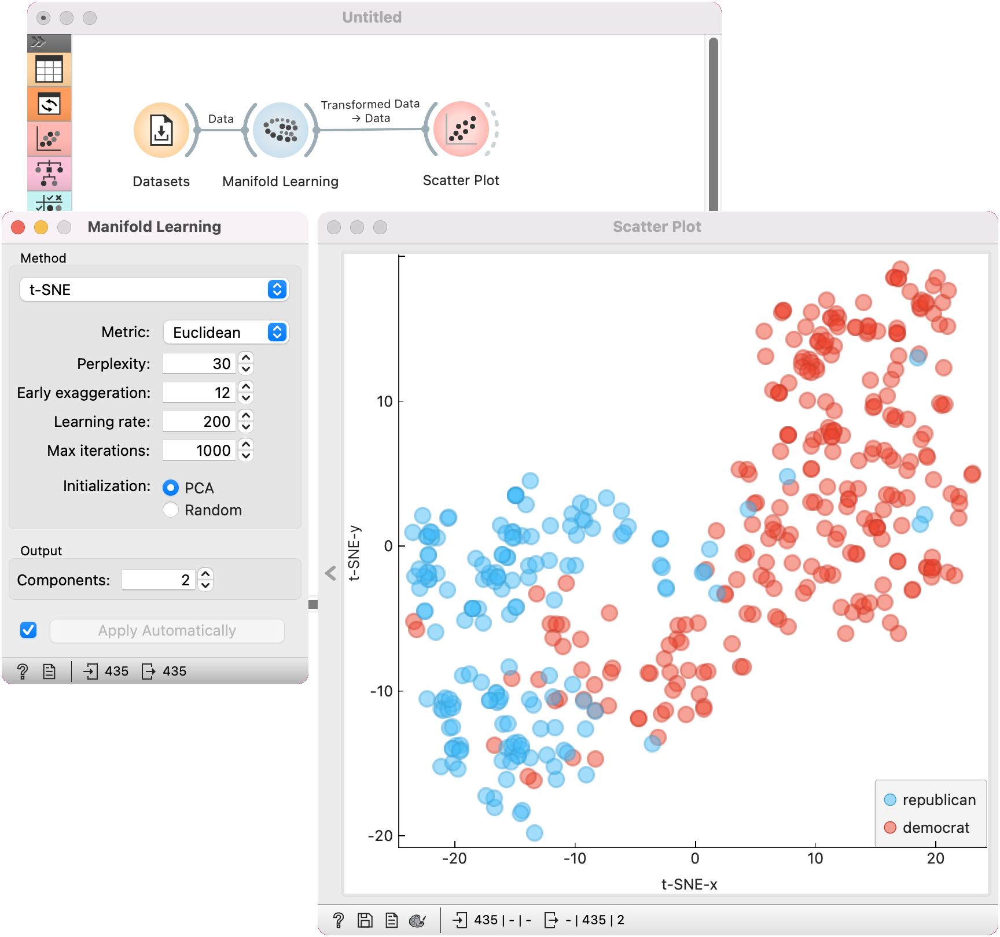

Manifold Learning
=================

Nonlinear dimensionality reduction.

**Inputs**

- Data: input dataset

**Outputs**

- Transformed Data: dataset with reduced coordinates

[Manifold Learning](https://en.wikipedia.org/wiki/Nonlinear_dimensionality_reduction) is a technique which finds a non-linear manifold within the higher-dimensional space. The widget then outputs new coordinates which correspond to a two-dimensional space. Such data can be later visualized with [Scatter Plot](../visualize/scatterplot.md) or other visualization widgets.

{width=50%}

1. Method for manifold learning:
   - [t-SNE](http://scikit-learn.org/stable/modules/manifold.html#t-distributed-stochastic-neighbor-embedding-t-sne), see also [t-SNE](../unsupervised/tsne.md) widget
     - Metric: set a distance measure (Euclidean, Manhattan, Chebyshev, Jaccard)
     - Perplexity: roughly the number of nearest neighbors to which distances will be preserved
     - Early exaggeration: increase the attractive forces between points
     - Learning rate: how much parameters are adjusted during each optimization step
     - Max iterations: maximum number of times optimization is run
     - Initialization: method for initialization of the algorithm (PCA or random)
   - [MDS](http://scikit-learn.org/stable/modules/manifold.html#multi-dimensional-scaling-mds), see also [MDS widget](../unsupervised/mds.md)
     - *max iterations*: maximum number of times optimization is run
     - *initialization*: method for initialization of the algorithm (PCA or random)
   - [Isomap](http://scikit-learn.org/stable/modules/manifold.html#isomap)
     - number of *neighbors*: local geometry to consider in dimensionality reduction
   - [Locally Linear Embedding](http://scikit-learn.org/stable/modules/manifold.html#locally-linear-embedding)
     - *method*: standard, modified, [hessian eigenmap](http://scikit-learn.org/stable/modules/manifold.html#hessian-eigenmapping), or local
     - number of *neighbors*: local geometry to consider in dimensionality reduction
     - *max iterations*: maximum number of times optimization is run
   - [Spectral Embedding](http://scikit-learn.org/stable/modules/manifold.html#spectral-embedding)
     - *affinity*: method for constructing affinity matrix (nearest neighbors or RFB kernel)
2. Output: the number of reduced features (components).
3. If *Apply automatically* is ticked, changes will be propagated automatically. Alternatively, click *Apply*.

**Manifold Learning** widget produces different embeddings for high-dimensional data.

From left to right, top to bottom: t-SNE, MDS, Isomap, Locally Linear Embedding and Spectral Embedding.

Preprocessing
-------------

All projections use default preprocessing if necessary. It is executed in the following order:

- continuization of categorical variables (with one feature per value)
- imputation of missing values with mean values

To override default preprocessing, preprocess the data beforehand with [Preprocess](../data/preprocess.md) widget.

Example
-------

*Manifold Learning* widget transforms high-dimensional data into a lower dimensional approximation. This makes it great for visualizing datasets with many features. We used *voting.tab* to map 16-dimensional data onto a 2D graph. Then we used [Scatter Plot](../visualize/scatterplot.md) to plot the embeddings.

