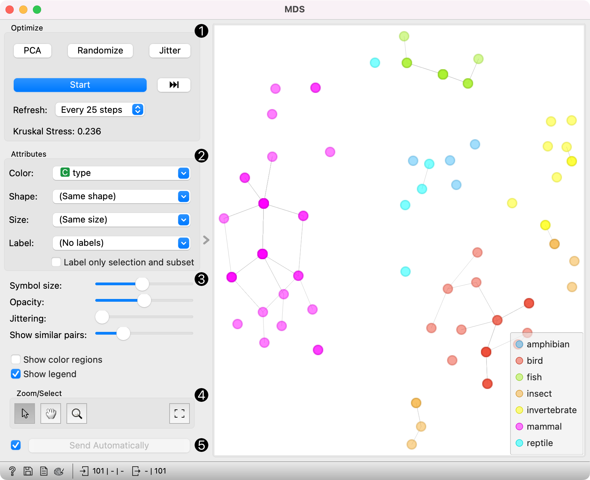
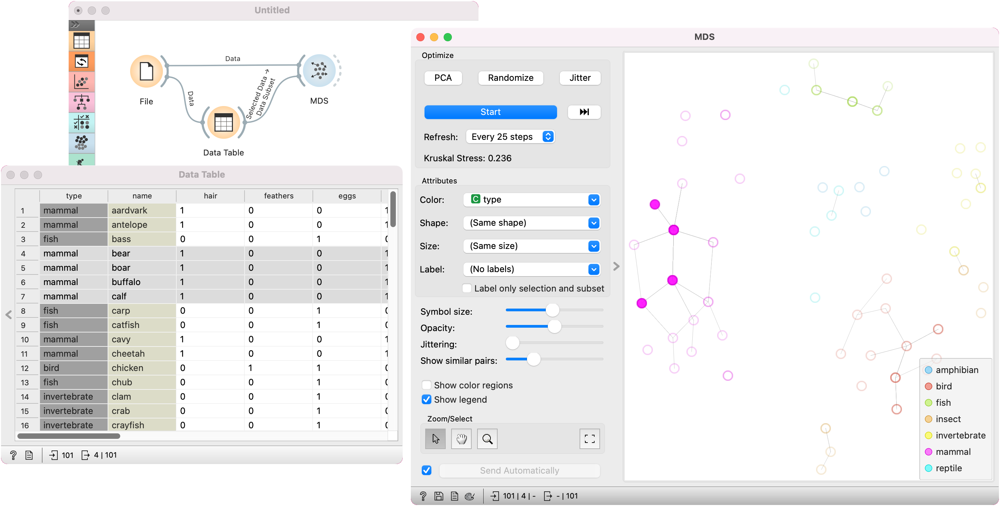
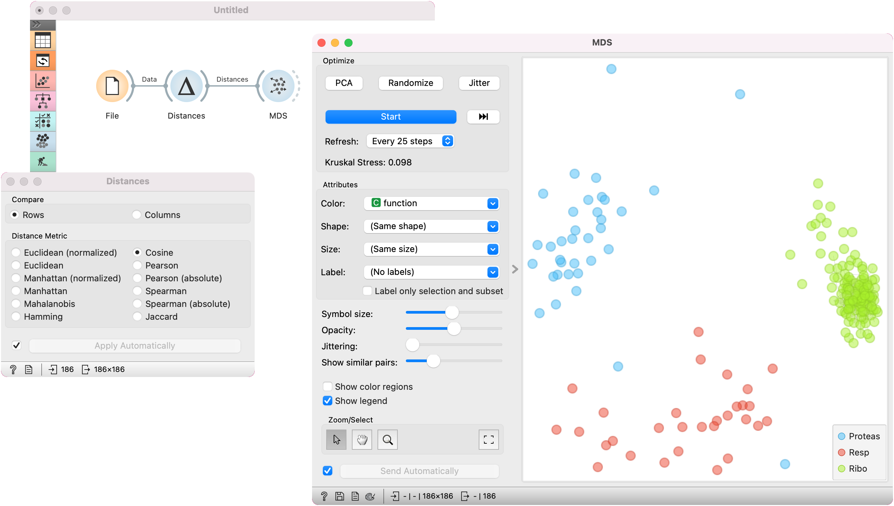

MDS
===

Multidimensional scaling (MDS) projects items onto a plane fitted to given distances between points.

**Inputs**

- Data: input dataset
- Data Subset: subset of instances
- Distances: distance matrix

**Outputs**

- Selected Data: instances selected from the plot
- Data: dataset with MDS coordinates and an additional column showing whether a point is selected

[Multidimensional scaling](https://en.wikipedia.org/wiki/Multidimensional_scaling) is a technique which finds a low-dimensional (in our case a two-dimensional) projection of points, where it tries to fit distances between points as well as possible. The perfect fit is typically impossible to obtain since the data is high-dimensional or the distances are not [Euclidean](https://en.wikipedia.org/wiki/Euclidean_distance).

In the input, the widget needs either a dataset or a matrix of distances. When visualizing distances between rows, you can also adjust the color of the points, change their shape, mark them, and output them upon selection.

The algorithm iteratively moves the points around in a kind of a simulation of a physical model: if two points are too close to each other (or too far away), there is a force pushing them apart (or together). The change of the point's position at each time interval corresponds to the sum of forces acting on it.

1. The widget redraws the projection during optimization. Optimization is run automatically in the beginning and later by pushing *Start*. Pushing the *forward* button runs the optimisation to the next step, defined in the *Referesh* rate.
   Optimize the projection using PCA (Torgerson) or random initialization. **PCA** positions the initial points along principal coordinate axes. **Random** sets the initial points to a random position and then readjusts them. **Jitter** randomly scatters data points within a small neighborhood (jitters them from their positions).
   **Refresh**: Set how often you want to refresh the visualization. It can be at *Every iteration*, *Every 5/10/25/50 steps* or never (*None*). Setting a lower refresh interval makes the animation more visually appealing, but can be slow if the number of points is high.
   Kruskal's stress measures the goodness of fit of the projection to the original data. Lower value indicates better fit.
2. Defines how the points are visualized. These options are available only when visualizing distances between rows (selected in the [Distances](../unsupervised/distances.md) widget).
   - **Color**: Color of points by attribute (gray for continuous, colored for discrete).
   - **Shape**: Shape of points by attribute (only for discrete).
   - **Size**: Set the size of points (*Same size* or select an attribute) or let the size depend on the value of the continuous attribute the point represents (Stress).
   - **Label**: Discrete attributes can serve as a label.
   *Label only selected points* allows you to select individual data instances and label only those.
3. Adjust graph attributes:
   - **Symbol size**: Adjust the size of the dots.
   - **Opacity**: Adjust the transparency level of the dots.
   - **Jittering**: Set [jittering](https://en.wikipedia.org/wiki/Jitter) to prevent the dots from overlapping.
   - **Show similar pairs**: Adjust the strength of network lines.
   
   *Show color regions*: colors the graph by class.
   *Show legend*: displays a legend on the right. Click and drag the legend to move it.
4. Adjust the graph with *Zoom/Select*. The arrow enables you to select data instances. The magnifying glass enables zooming, which can be also done by scrolling in and out. The hand allows you to move the graph around. The rectangle readjusts the graph proportionally.
5. Sending the instances can be automatic if *Send selected automatically* is ticked. Alternatively, click *Send selected*.

The MDS graph is in many respects similar to the [Scatter Plot](../visualize/scatterplot.md) widget, so we recommend reading that widget's description as well.

Preprocessing
-------------

When given *Distances* on the input, preprocessing is not applied. When given *Data*, MDS uses default preprocessing if necessary. Preprocessing is executed in the following order:

- continuizing categorical variables (with one feature per value)
- imputing missing values with mean values

To override default preprocessing, preprocess the data beforehand with [Preprocess](../data/preprocess.md) widget.

Examples
--------

In the first example, we used the *zoo.tab* dataset. We pass the data to MDS and to [Data Table](../data/datatable.md). In the data table, we selected four mammals, namely bear, boar, buffalo, and calf. We wish to observe them in a visualization, so we pass them to MDS, which exposes their position in the graph.

In the second example, we used the *brown-selected* data set and passed it to the [Distances](../unsupervised/distances.md) widget to compute the distance matrix based on *cosine* distances. We observe the 2D embedding in the MDS widget.

### References

Wickelmaier, F. (2003). An Introduction to MDS. Sound Quality Research Unit, Aalborg University. Available [here](https://homepages.uni-tuebingen.de/florian.wickelmaier/pubs/Wickelmaier2003SQRU.pdf).
