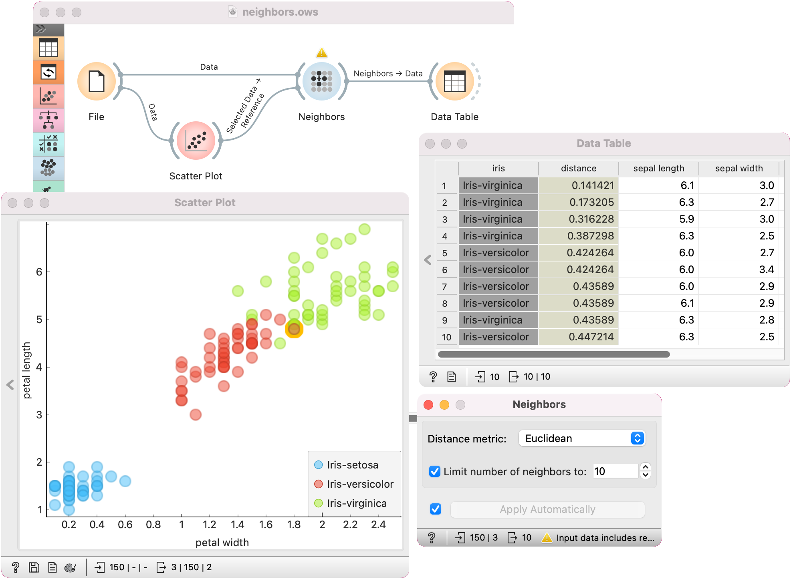
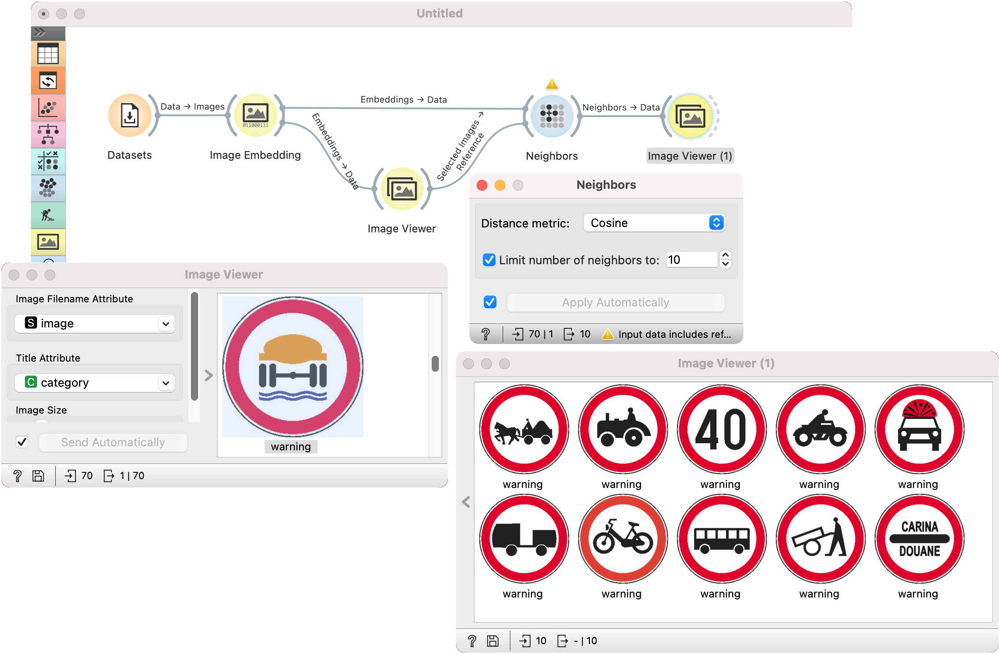

Neighbors
=========

Compute nearest neighbors in data according to reference.

**Inputs**

- Data: An input data set.
- Reference: A reference data for neighbor computation. 

**Outputs**

- Neighbors: A data table of nearest neighbors according to reference.

The **Neighbors** widget computes nearest neighbors for a given reference and for a given distance measure. The reference can be either one instance or more instances. In the case with one reference widget outputs closest `n` instances from data where `n` is set by the *Limit number of neighbors to* option in the widget. When reference contains more instances, widget computes the combined distance for each data instance as a minimum of distances to each reference. Widget outputs `n` data instances with lowest combined distance.

{width=50%}

1. *Distance metric* for computing neighbors. Supported measures are: Euclidean, Manhattan, Mahalanobis, Cosine, Jaccard, Spearman, absolute Spearman, Pearson, absolute Pearson. 
   *Limit number of neighbors to*: Number of neighbors on the output.
2. Click *Apply* to commit the changes. To communicate changes automatically tick *Apply Automatically*.

Examples
--------

In the first example, we used *iris* data and passed it to **Neighbors** and to [Scatter Plot](../visualize/scatterplot.md). In Scatter Plot, we selected an instance of iris, that will serve as our reference, meaning we wish to retrieve 10 closest examples to the selected data instance. We connect Data Table to Neighbors as well.

We can observe the results of neighbor computation in Data Table, where we can see 10 closest images to our selected iris flower. We see that, expectedly, some are iris virginicas and some are versicolors.

Another example requires the installation of Image Analytics add-on. We loaded traffic signs dataset from the [Datasets](../data/datasets.md) widget and passed them to [Image Embedding](https://orangedatamining.com/widget-catalog/image-analytics/imageembedding/), with which we embedded the images. Remember, Neighbors widget (and any kind of downstream processing of images), requires numerically described instances.

Then the procedure is the same as above. We passed embedded images to [Image Viewer](https://orangedatamining.com/widget-catalog/image-analytics/imageviewer/) and selected an interesting traffic sign as our reference image. We passed the image to Neighbors, where we set the distance measure to *cosine*. We can observe the results in another Image Viewer.

