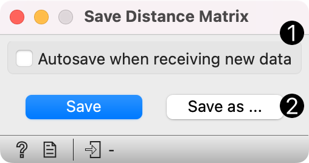
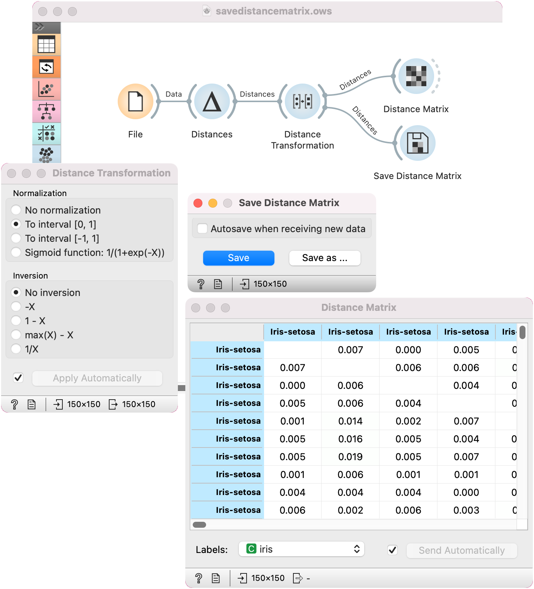

Save Distance Matrix
====================

Saves a distance matrix.

**Inputs**

- Distances: distance matrix

{width=200px}

1. By selecting *Autosave when receiving new data*, all incoming changes will be saved automatically, thus overwriting the selected file.
2. By clicking *Save*, the input distance matrix will be saved as an .xlsx or .dst file. The standard save dialogue will open the first time you click the button. By clicking *Save as*, the save dialogue will re-open, enabling you to save the file under a new name.

Load the saved matrix with the [Distance File](../unsupervised/distancefile.md) widget.

Example
-------

In the snapshot below, we used computed distance matrix on the *iris* data using the [Distances](../unsupervised/distances.md) widget. Then, we used the [Distance Transformation](../unsupervised/distancetransformation.md) widget to transform the distances to the [0, 1] interval. We then chose to save the transformed version to our computer, so we could use it later on. We can observe the transformed matrix in a [Distance Matrix](../unsupervised/distancematrix.md).

