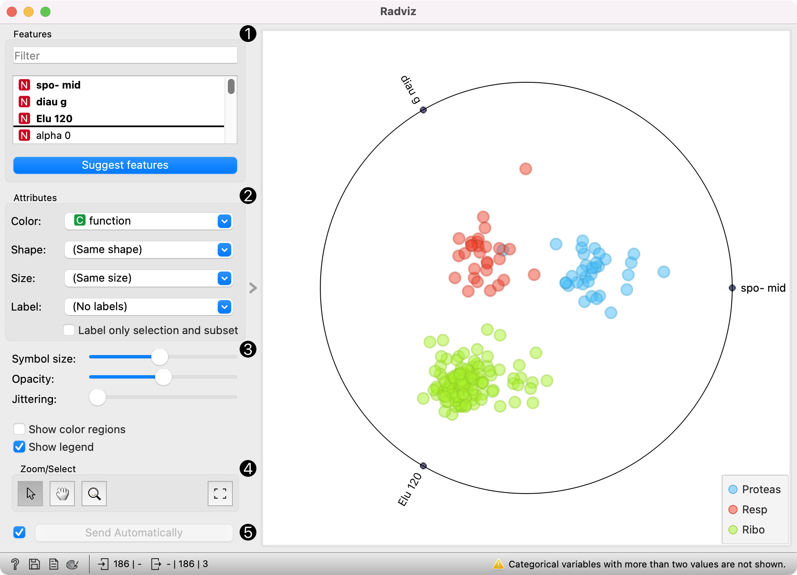

Radviz
======

Radviz vizualization with explorative data analysis and intelligent data visualization enhancements.

**Inputs**

- Data: input dataset
- Data Subset: subset of instances

**Outputs**

- Selected Data: instances selected from the plot
- Data: data with an additional column showing whether a point is selected
- Components: Radviz vectors

Radviz (Hoffman et al. 1997) is a non-linear multi-dimensional visualization technique that can display data defined by three or more variables in a 2-dimensional projection. The visualized variables are presented as anchor points equally spaced around the perimeter of a unit circle. Data instances are shown as points inside the circle, with their positions determined by a metaphor from physics: each point is held in place with springs that are attached at the other end to the variable anchors. The stiffness of each spring is proportional to the value of the corresponding variable and the point ends up at the position where the spring forces are in equilibrium. Prior to visualization, variable values are scaled to lie between 0 and 1. Data instances that are close to a set of variable anchors have higher values for these variables than for the others.

The snapshot shown below shows a Radviz widget with a visualization of the dataset from functional genomics (Brown et al. 2000). In this particular visualization the data instances are colored according to the corresponding class. Notice that the particular visualization very nicely separates data instances of different class, making the visualization interesting and potentially informative.

Just like all point-based visualizations, this widget includes tools for intelligent data visualization (VizRank, see Leban et al. 2006) and an interface for explorative data analysis - selection of data points in visualization. Just like the [Scatter Plot](../visualize/scatterplot.md) and [FreeViz](../visualize/freeviz.md) widgets, it can be used to find a set of variables that would result in an interesting visualization. The Radviz graph above is according to this definition an example of a very good visualization, suggested by the VizRank's interface (*Suggest features* button).

Example
-------

In this example, we are using the *brown-selected* dataset from the [File](../data/file.md) widget. We have used [Rank](../data/rank.md) to find five features that best separate the class, the gene function in this case. The Radviz plot shows the top five features, with the visualization space colored according to the computed class probability. The data points are pulled according to their feature values. Genes coding for ribosomal proteins have, for example, high values of *spo5 11* feature.

References
----------

Hoffman, P. E. et al. (1997) DNA visual and analytic data mining. In the Proceedings of the IEEE Visualization. Phoenix, AZ, pp. 437-441.

Brown, M. P., W. N. Grundy et al. (2000). "Knowledge-based analysis of microarray gene expression data by using support vector machines." Proc Natl Acad Sci U S A 97(1): 262-7.

Leban, G., B. Zupan et al. (2006). "VizRank: Data Visualization Guided by Machine Learning." Data Mining and Knowledge Discovery 13(2): 119-136.

Mramor, M., G. Leban, J. Demsar, and B. Zupan. Visualization-based cancer microarray data classification analysis. Bioinformatics 23(16): 2147-2154, 2007.
