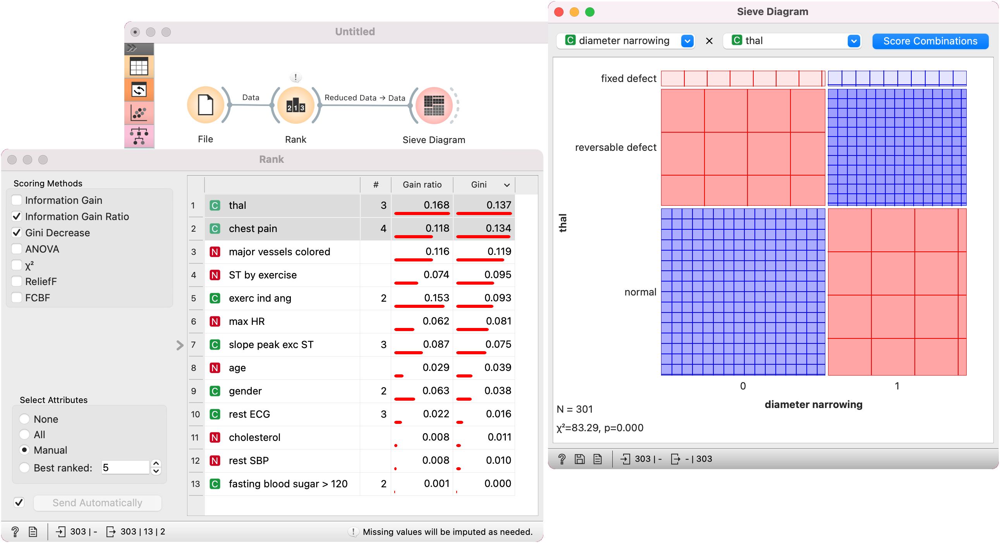

Sieve Diagram
=============

Plots a sieve diagram for a pair of attributes.

**Inputs**

- Data: input dataset
- Features: list of attributes

**Outputs**

- Selected Data:
- Data: data with an additional column showing whether an instance is selected

A **Sieve Diagram** is a graphical method for visualizing frequencies in a two-way contingency table and comparing them to [expected frequencies](http://cnx.org/contents/d396c4ad-2fd7-47cd-be84-152b44880feb@2/What-is-an-expected-frequency) under assumption of independence. It was proposed by Riedwyl and Schüpbach in a technical report in 1983 and later called a parquet diagram (Riedwyl and Schüpbach 1994). In this display, the area of each rectangle is proportional to the expected frequency, while the observed frequency is shown by the number of squares in each rectangle (grid). The difference between observed and expected frequency (proportional to the standard Pearson residual) appears as the density of shading, using color to indicate whether the deviation from independence is positive (blue) or negative (red).

1. Select the attributes you want to display in the plot.
2. *Score Combinations* enables you to find the best possible combination of attributes.
3. Plot statistics: number of instances (N), χ² statistic and the corresponding p-value.

The snapshot above shows a sieve diagram for the *Titanic* dataset and has the attributes *sex* and *survived* (the latter is a class attribute in this dataset). The plot shows that the two variables are highly associated, as there are substantial differences between observed and expected frequencies in all of the four quadrants. For example, and as highlighted in the balloon, the chance for surviving the accident was much higher for female passengers than expected (0.06 vs. 0.15).

Pairs of attributes with interesting associations have a strong shading, such as the diagram shown in the above snapshot.

Example
-------

Below, we see a simple schema using the *Titanic* dataset, where we use the
[Rank](../data/rank.md) widget to select the best attributes (the ones with the highest information gain, gain ratio or Gini index) and feed them into the **Sieve Diagram**. This displays the sieve plot for the two best attributes, which in our case are sex and status. We see that the survival rate on the Titanic was very high for women of the first class and very low for female crew members.

The **Sieve Diagram** also features the *Score Combinations* option, which makes the ranking of attributes even easier.

References
----------

Riedwyl, H., and Schüpbach, M. (1994). Parquet diagram to plot contingency tables. In Softstat '93: Advances in Statistical Software, F. Faulbaum (Ed.). New York: Gustav Fischer, 293-299.
